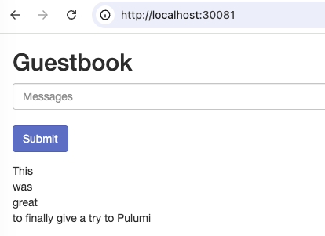
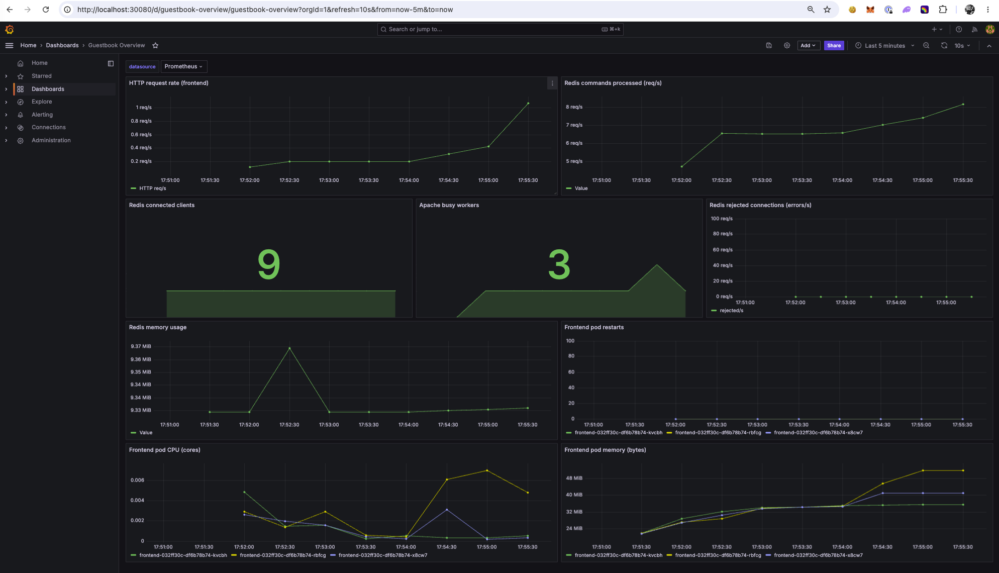

# Guestbook + Monitoring (Pulumi / TypeScript)

Extends the [Pulumi Kubernetes Guestbook example](https://github.com/pulumi/examples/tree/master/kubernetes-ts-guestbook)
with a full **Prometheus + Grafana** observability stack, deployed to the same
cluster with Pulumi.

## What gets deployed

**`guestbook` namespace**

- `redis-leader` (1 replica) + `redis-follower` (2 replicas) — the backend.
  Each Redis pod runs an **`oliver006/redis_exporter`** sidecar on port `9121`.
- `frontend` (3 replicas) — the PHP/Apache guestbook UI on port `80`, plus an
  **`lusotycoon/apache-exporter`** sidecar on port `9117` (scrapes Apache
  `mod_status`, enabled via a mounted ConfigMap).
- **ServiceMonitors** (`redis-leader`, `redis-follower`, `frontend`) that tell
  Prometheus to scrape each tier's `metrics` port.
- **PrometheusRules** (`guestbook-alerts`) for Redis down, rejected connections,
  and no-traffic conditions.

**`monitoring` namespace** (via the `kube-prometheus-stack` Helm chart)

- Prometheus + Prometheus Operator (provides the `ServiceMonitor` CRD)
- Grafana, pre-wired to Prometheus, exposed as a `LoadBalancer` (or `NodePort`)
- node-exporter, kube-state-metrics and cAdvisor scrape jobs
- an auto-imported **"Guestbook Overview"** dashboard (the stretch goal)

### How metrics are collected

| Signal                          | Source                                               | Scrape method                                  |
| ------------------------------- | ---------------------------------------------------- | ---------------------------------------------- |
| HTTP request rate (frontend)    | `apache_accesses_total` from apache_exporter         | ServiceMonitor → frontend                      |
| Backend command / activity rate | `redis_commands_processed_total` from redis_exporter | ServiceMonitor → redis-leader / redis-follower |
| Active Redis connections        | `redis_connected_clients`                            | ServiceMonitor → redis                         |
| Backend errors                  | `redis_rejected_connections_total`                   | ServiceMonitor → redis                         |
| Apache worker saturation        | `apache_workers{state="busy"}`                       | ServiceMonitor → frontend                      |
| Pod CPU / memory                | `container_*` metrics                                | Built-in cAdvisor job (all pods)               |
| Pod restarts                    | `kube_pod_container_status_restarts_total`           | Built-in kube-state-metrics job                |

The stock PHP image does not emit Prometheus metrics natively. Instead, an
**apache_exporter sidecar** scrapes Apache `mod_status` locally (same sidecar +
ServiceMonitor pattern as Redis). Per-status HTTP error rates (4xx/5xx) would
require access-log parsing in production; here we use Redis rejected connections
and pod restart counters as error proxies.

### Design decisions

- **ServiceMonitor CRDs over pod annotations** — `kube-prometheus-stack` uses the
  Prometheus Operator, which discovers scrape targets via ServiceMonitor/PodMonitor
  CRs, not `prometheus.io/*` annotations.
- **Sidecar exporters over forking images** — third-party images (`pulumi/guestbook-php-redis`,
  `redis:6.2-alpine`) are instrumented with co-located exporters; no custom image
  build required.
- **Redis command rate ≠ HTTP requests** — `redis_commands_processed_total` is a
  backend activity proxy (reads + writes); `apache_accesses_total` is the true HTTP
  request counter.
- **Production next steps** — longer Prometheus retention, Alertmanager routing,
  access-log metrics for per-status errors, distributed tracing.

## Prerequisites

- [Pulumi CLI](https://www.pulumi.com/docs/install/) + a Pulumi account/backend
- Node.js 18+
- A Kubernetes cluster + `kubectl` context (EKS/GKE/AKS for LoadBalancers, or
  Minikube/kind — see below)
- Helm support is built into `@pulumi/kubernetes`; no separate Helm CLI needed

## Quick start — local cluster with kind (one command)

The `scripts/deploy.sh` script fully automates a local run: it checks tooling, bootstraps
a **kind** cluster, waits for it to be healthy, runs the Pulumi deployment against
that cluster, and prints all access details.

```bash
cd guestbook-monitoring
cp config/.env.example .env   # optional — edit ports, passwords, stack name
bash scripts/deploy.sh        # or: ./scripts/deploy.sh   (chmod +x scripts/deploy.sh first)
```

What it does, in order:

1. Verifies `docker`, `kind`, `kubectl`, `pulumi`, `node`/`npm` are present — on
   **macOS** it offers to `brew install` anything missing; confirms the Docker
   daemon is running.
2. Creates a kind cluster (`1` control-plane + `N` workers) **or reuses** one that
   already exists with the same name. Grafana/Guestbook NodePorts are mapped to
   host ports so they're reachable at `localhost`.
3. Waits for all nodes (and kube-system pods) to be `Ready`.
4. Logs into the Pulumi backend (local file backend by default — no account
   needed), installs deps, selects/creates the stack, sets config, runs
   `pulumi refresh` (so a recreated kind cluster does not leave stale
   namespaces in state), then `pulumi up`.
5. Prints the Guestbook URL, Grafana URL + admin credentials, and the verify
   command.

**Modes & flags:**

```bash
bash scripts/deploy.sh --interactive     # prompt for each setting (cluster name, ports, passwords…)
bash scripts/deploy.sh --env-file prod.env
bash scripts/deploy.sh --yes             # skip the pulumi up confirmation
bash scripts/deploy.sh --destroy         # pulumi destroy + delete the kind cluster
bash scripts/deploy.sh --help
```

Config precedence: `--interactive` prompts override `.env`, which overrides
built-in defaults. Key variables (see `config/.env.example`): `CLUSTER_NAME`,
`KIND_WORKER_NODES`, `GRAFANA_NODE_PORT` (default `30080`), `FRONTEND_NODE_PORT`
(default `30081`), `PULUMI_STACK`, `PULUMI_BACKEND_URL`,
`PULUMI_CONFIG_PASSPHRASE`, `GRAFANA_ADMIN_PASSWORD`.

After it finishes: **Guestbook** → `http://localhost:30081`, **Grafana** →
`http://localhost:30080` (admin / your password).

## Manual deploy (any cluster)

```bash
cd guestbook-monitoring
npm install
pulumi stack init dev

# Optional config:
pulumi config set useLoadBalancer true                 # false for Minikube/kind
pulumi config set --secret grafanaAdminPassword <pw>   # default: prom-operator

pulumi up
```

First `pulumi up` takes a few minutes (CRD install + operator + LB provisioning).

### Minikube / kind (manual)

```bash
pulumi config set useLoadBalancer false
pulumi config set grafanaNodePort 30080
pulumi config set frontendNodePort 30081
# kind only — skips control-plane ServiceMonitors that cannot be scraped locally
pulumi config set localKindCluster true
pulumi up
```

On Minikube: `minikube service kps-grafana -n monitoring --url`. On kind you need
the NodePort→host mappings that `scripts/deploy.sh` sets up (see the kind quick start).
`scripts/deploy.sh` sets `localKindCluster=true` automatically; use the line above for
manual kind deploys.

## Access Grafana

Default credentials (override via `grafanaAdminPassword` config):

| Field        | Value                               |
| ------------ | ----------------------------------- |
| **URL**      | `pulumi stack output grafanaUrl`    |
| **User**     | `admin`                             |
| **Password** | `prom-operator` (unless overridden) |

```bash
pulumi stack output grafanaUrl
pulumi stack output grafanaAdminUser
pulumi stack output grafanaAdminPassword --show-secrets
```

Open Grafana → **Dashboards → Guestbook Overview**.

## Verify metrics are being scraped

1. Port-forward Prometheus and open its UI:
   ```bash
   kubectl -n monitoring port-forward svc/kps-kube-prometheus-stack-prometheus 9090
   ```
   Open <http://localhost:9090>.
2. **Status → Target health** — confirm these guestbook targets are **UP**:
   - `serviceMonitor/guestbook/redis-leader`
   - `serviceMonitor/guestbook/redis-follower`
   - `serviceMonitor/guestbook/frontend`

   On **kind** (via `scripts/deploy.sh` or `localKindCluster=true`), control-plane targets
   (`kube-controller-manager`, `kube-etcd`, `kube-proxy`, `kube-scheduler`) are
   not configured. On **Minikube** without that flag, they may show as **DOWN** —
   that is expected and harmless; focus on the `guestbook/*` targets (plus
   `node-exporter`, `kube-state-metrics`, and cAdvisor).

3. Run queries, e.g.:
   ```promql
   rate(apache_accesses_total[1m])
   rate(redis_commands_processed_total[1m])
   ```
   Then generate traffic by signing the guestbook (open `guestbookUrl` and add a
   few entries) and watch both rates climb.
4. Resource usage sanity check:
   ```promql
   sum(rate(container_cpu_usage_seconds_total{namespace="guestbook", pod=~"frontend-.*"}[1m])) by (pod)
   ```
5. Confirm alerting rules loaded: **Status → Rules** → group `guestbook.rules`.

## Tear down

```bash
pulumi destroy
pulumi stack rm dev
```

## Project layout

```
guestbook-monitoring/
├── config/
│   └── .env.example      # template for deploy settings (copy to .env at repo root)
├── scripts/
│   └── deploy.sh         # kind bootstrap + Pulumi deploy automation
├── src/                  # Pulumi program (TypeScript)
│   ├── index.ts          # namespaces, wiring, stack outputs
│   ├── guestbook.ts      # redis + frontend (+exporters) + ServiceMonitors
│   ├── monitoring.ts     # kube-prometheus-stack Helm release + dashboard ConfigMap
│   ├── dashboard.ts      # Grafana "Guestbook Overview" dashboard JSON
│   ├── alerts.ts         # PrometheusRule CRs for Guestbook health
│   └── urls.ts           # LoadBalancer / NodePort URL helpers
├── Pulumi.yaml           # project + config schema
├── Pulumi.dev.yaml       # stack config (encrypted secrets)
├── package.json
└── tsconfig.json
```

## Screenshots

**Guestbook**


**Grafana Dashboard**


## Running pods

```
kubectl get pods --all-namespaces
NAMESPACE            NAME                                                    READY   STATUS    RESTARTS   AGE
guestbook            frontend-032ff30c-df6b78b74-kvcbh                       2/2     Running   0          7m51s
guestbook            frontend-032ff30c-df6b78b74-rbfcg                       2/2     Running   0          7m51s
guestbook            frontend-032ff30c-df6b78b74-x8cw7                       2/2     Running   0          7m51s
guestbook            redis-follower-d01ba331-7cd95df4dc-45gcf                2/2     Running   0          7m53s
guestbook            redis-follower-d01ba331-7cd95df4dc-xllf9                2/2     Running   0          7m53s
guestbook            redis-leader-312200f8-668f9649b5-bzzjp                  2/2     Running   0          7m53s
kube-system          coredns-66bc5c9577-6cdt5                                1/1     Running   0          10m
kube-system          coredns-66bc5c9577-vzvcd                                1/1     Running   0          10m
kube-system          etcd-guestbook-control-plane                            1/1     Running   0          10m
kube-system          kindnet-dxft7                                           1/1     Running   0          10m
kube-system          kindnet-gp86n                                           1/1     Running   0          10m
kube-system          kindnet-ndw64                                           1/1     Running   0          10m
kube-system          kube-apiserver-guestbook-control-plane                  1/1     Running   0          10m
kube-system          kube-controller-manager-guestbook-control-plane         1/1     Running   0          10m
kube-system          kube-proxy-9vwgd                                        1/1     Running   0          10m
kube-system          kube-proxy-mqms8                                        1/1     Running   0          10m
kube-system          kube-proxy-pdnzb                                        1/1     Running   0          10m
kube-system          kube-scheduler-guestbook-control-plane                  1/1     Running   0          10m
local-path-storage   local-path-provisioner-7b8c8ddbd6-ccdfw                 1/1     Running   0          10m
monitoring           alertmanager-kps-kube-prometheus-stack-alertmanager-0   2/2     Running   0          7m19s
monitoring           kps-grafana-7dbb5dd87-f4tz9                             3/3     Running   0          7m26s
monitoring           kps-kube-prometheus-stack-operator-8689b67b74-94k2k     1/1     Running   0          7m26s
monitoring           kps-kube-state-metrics-56746bbcf4-pxvjv                 1/1     Running   0          7m26s
monitoring           kps-prometheus-node-exporter-cgjkf                      1/1     Running   0          7m26s
monitoring           kps-prometheus-node-exporter-gmdkg                      1/1     Running   0          7m26s
monitoring           kps-prometheus-node-exporter-tlst9                      1/1     Running   0          7m26s
monitoring           prometheus-kps-kube-prometheus-stack-prometheus-0       2/2     Running   0          7m19s
```

## Running services

```
kubectl get svc -n guestbook
NAME             TYPE        CLUSTER-IP      EXTERNAL-IP   PORT(S)                       AGE
frontend         NodePort    10.96.222.107   <none>        80:30081/TCP,9117:30974/TCP   8m25s
redis-follower   ClusterIP   10.96.151.243   <none>        6379/TCP,9121/TCP             8m25s
redis-leader     ClusterIP   10.96.182.219   <none>        6379/TCP,9121/TCP             8m25s
redis-replica    ClusterIP   10.96.22.1      <none>        6379/TCP,9121/TCP             8m25s
```

```
kubectl get svc -n monitoring
NAME                                     TYPE        CLUSTER-IP      EXTERNAL-IP   PORT(S)                      AGE
alertmanager-operated                    ClusterIP   None            <none>        9093/TCP,9094/TCP,9094/UDP   9m30s
kps-grafana                              NodePort    10.96.210.228   <none>        80:30080/TCP                 9m37s
kps-kube-prometheus-stack-alertmanager   ClusterIP   10.96.174.51    <none>        9093/TCP,8080/TCP            9m37s
kps-kube-prometheus-stack-operator       ClusterIP   10.96.10.227    <none>        443/TCP                      9m37s
kps-kube-prometheus-stack-prometheus     ClusterIP   10.96.202.182   <none>        9090/TCP,8080/TCP            9m37s
kps-kube-state-metrics                   ClusterIP   10.96.138.95    <none>        8080/TCP                     9m37s
kps-prometheus-node-exporter             ClusterIP   10.96.71.47     <none>        9100/TCP                     9m37s
prometheus-operated                      ClusterIP   None            <none>        9090/TCP                     9m30s
```
